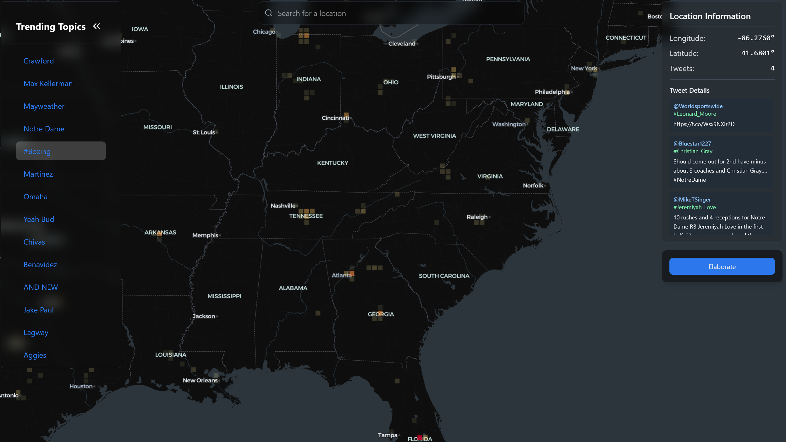
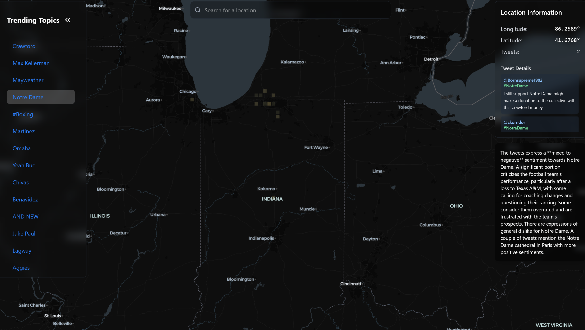

# The Daily Indigest

An interactive visualization platform that maps tweets with location data and provides AI-powered trend explanations including sentiment analysis through Gemini API. 

## Features

- Real-time tweet mapping with geographic visualization
- Topic-based tweet filtering and exploration (Top 25 trends are shown, top 50 can be obtained via API access)
- AI-powered topic explanations using Google Gemini 2.0 flash
- Location-based tweet clustering as well as location autocomplete

## Tech Stack

- React + Typescript + Tailwindcss with `deck.gl` for map visualization
- Rust with SpacetimeDB for storage and live feed
- Google Gemini API for topic analysis
- Apify for tweet collection API
- Flask hosting a small FLAN model along with geocoding API for location guessing

## Previews

---

## API Endpoints

- `GET` /api/trends
  - Returns an array of today's trending topics on twitter for the last hour
- `GET` /api/tweets
  - Returns all tweets collected on server
- `GET` /api/tweets/:topic
  - Returns a specific array of tweets tagged with a `topic`
- `GET` /api/flattened
  - Returns all tweets in a `topic, longitude, latitude, text, author` format
- `GET` /api/flattened/:topic
  - Returns all tweets in a `topic, longitude, latitude, text, author` format for a specific `topic`
